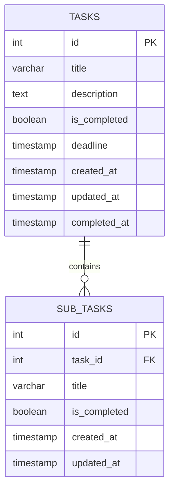

```mermaid
erDiagram
    TASKS ||--o{ SUB_TASKS : contains
    
    TASKS {
        int id PK
        varchar title
        text description
        boolean is_completed
        timestamp deadline
        timestamp created_at
        timestamp updated_at
        timestamp completed_at
    }
    
    SUB_TASKS {
        int id PK
        int task_id FK
        varchar title
        boolean is_completed
        timestamp created_at
        timestamp updated_at
    }
```